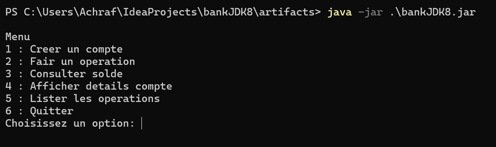
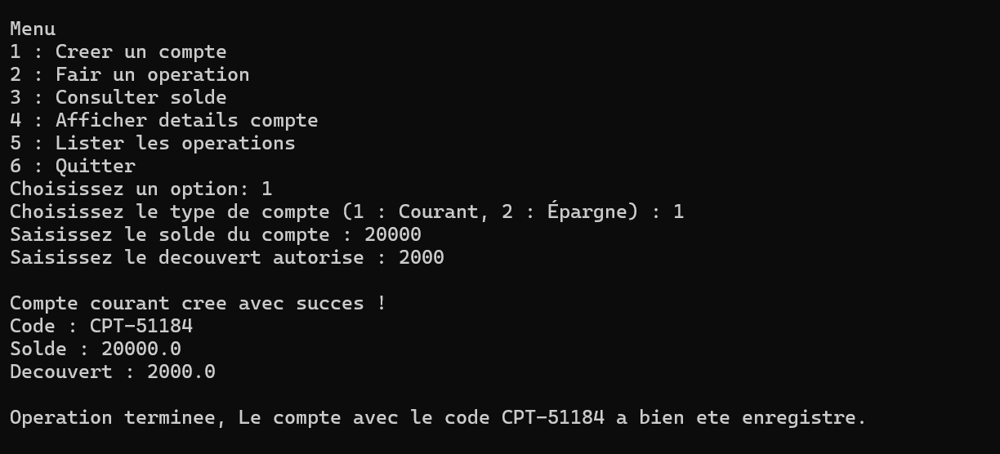
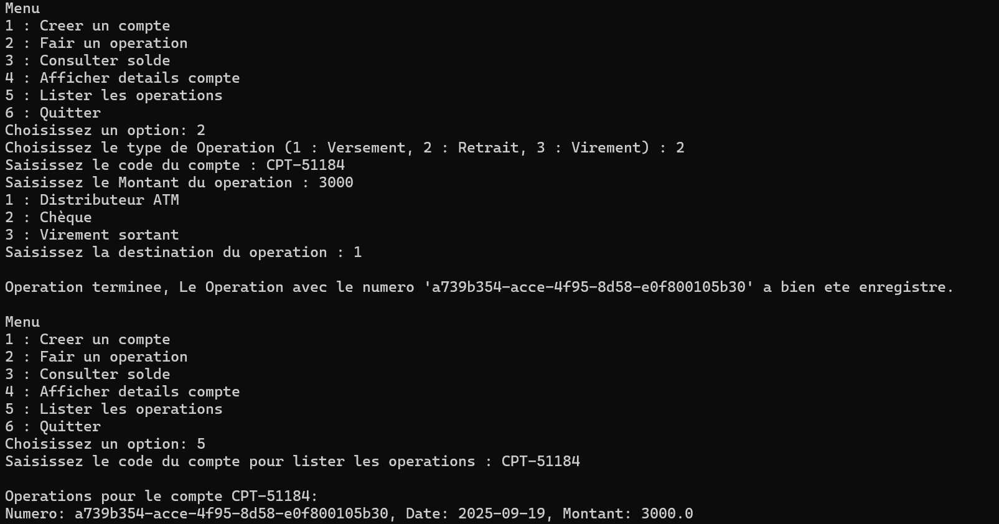
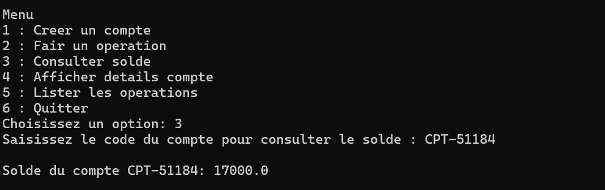
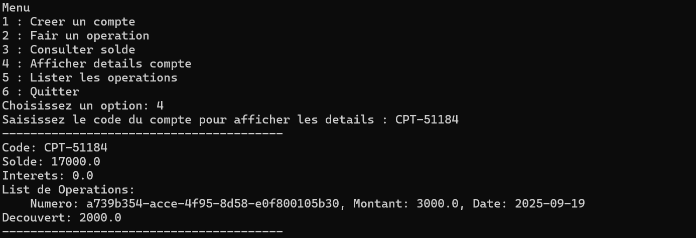

# bankJDK8

## Description du projet

Ce projet est une application bancaire simple développée en Java 8. Elle permet de gérer des comptes bancaires (courant et épargne), d'effectuer des opérations (versement, retrait, virement), de consulter le solde, d'afficher les détails d'un compte et de lister les opérations.

## Technologies utilisées

*   Java 8

## Planification:
*  https://achrafsikal.atlassian.net/jira/software/projects/BAN/boards/2?atlOrigin=eyJpIjoiNWE4MDlhMDllNzg0NGMwYzg5ODBhNjc0MjFmMzAzYzkiLCJwIjoiaiJ9 

## Structure du projet

Le projet est organisé en plusieurs packages :

*   `Controller`: Contient les contrôleurs qui gèrent les interactions utilisateur et orchestrent les opérations.
    *   `CompteController.java`: Gère la création de comptes, la consultation de solde, et l'affichage des détails des comptes.
    *   `MenuController.java`: Gère le menu principal de l'application et les navigations entre les différentes fonctionnalités.
    *   `OperationController.java`: Gère l'exécution et la liste des opérations.
*   `Model`: Définit les classes de base et les entités du domaine bancaire.
    *   `Compte.java`: Classe abstraite pour un compte bancaire, avec des fonctionnalités de base.
    *   `CompteCourant.java`: Implémentation d'un compte courant.
    *   `CompteEpargne.java`: Implémentation d'un compte épargne.
    *   `Operation.java`: Classe abstraite pour une opération bancaire.
    *   `Retrait.java`: Implémentation d'une opération de retrait.
    *   `Versement.java`: Implémentation d'une opération de versement.
*   `Service`: Contient la logique métier et les services d'application.
    *   `CompteCreatorService.java`: Gère la création des différents types de comptes.
    *   `OperationService.java`: Gère l'exécution et la récupération des opérations.
*   `Strategy`: Contient les implémentations du pattern Strategy pour la création de comptes et l'exécution d'opérations.
    *   `CreationCompteCourantStrategy.java`: Stratégie pour la création d'un compte courant.
    *   `CreationCompteEpargneStrategy.java`: Stratégie pour la création d'un compte épargne.
    *   `CreationCompteStrategy.java`: Interface pour la stratégie de création de compte.
    *   `OperationStrategy.java`: Interface pour la stratégie d'opération.
    *   `RetraitStrategy.java`: Stratégie pour un retrait.
    *   `VersementStrategy.java`: Stratégie pour un versement.
*   `Main.java`: Point d'entrée de l'application.

## Prérequis

*   Java Development Kit (JDK) 8
*   Un environnement de développement intégré (IDE) tel qu'IntelliJ IDEA.

## Captures d'écran

